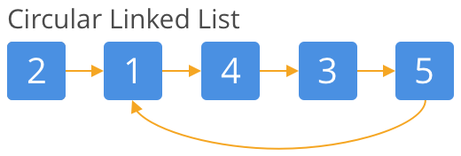

# Types of Linked Lists

In this notebook we'll explore three versions of linked-lists: singly-linked lists, doubly-linked lists, and circular lists.

## Singly Linked Lists

In this linked list, each node in the list is connected only to the next node in the list. 


This connection is typically implemented by setting the `next` attribute on a node object itself.


```python
class Node:
    def __init__(self, value):
        self.value = value
        self.next = None
```


```python
# A small linked list:

head = Node(1)
head.next = Node(2)
```

Above we have a simple linked list with two elements, `[1, 2]`. Usually you'll want to create a `LinkedList` class as a wrapper for the nodes themselves and to provide common methods that operate on the list. For example you can implement an `append` method that adds a value to the end of the list. Note that if we're only tracking the head of the list, this runs in linear time - $O(N)$ - since you have to iterate through the entire list to get to the tail node. However, prepending (adding to the head of the list) can be done in constant $O(1)$ time. You'll implement this `prepend` method in the Linked List Practice notebook.


```python
class LinkedList:
    def __init__(self):
        self.head = None
        
    def append(self, value):
        if self.head is None:
            self.head = Node(value)
            return
        
        # Move to the tail (the last node)
        node = self.head
        while node.next:
            node = node.next
        
        node.next = Node(value)
        return
```


```python
linked_list = LinkedList()
linked_list.append(1)
linked_list.append(2)
linked_list.append(4)

node = linked_list.head
while node:
    print(node.value)
    node = node.next
```

>**Exercise:** Add a method `to_list()` to `LinkedList` that converts a linked list back into a Python list.


```python
class LinkedList:
    def __init__(self):
        self.head = None
        
    def append(self, value):
        if self.head is None:
            self.head = Node(value)
            return
        
        # Move to the tail (the last node)
        node = self.head
        while node.next:
            node = node.next
        
        node.next = Node(value)
        return
    
    def to_list(self):
        
        # TODO: Write function to turn Linked List into Python List
        
        pass
```


```python
# Test your method here
linked_list = LinkedList()
linked_list.append(3)
linked_list.append(2)
linked_list.append(-1)
linked_list.append(0.2)

print ("Pass" if  (linked_list.to_list() == [3, 2, -1, 0.2]) else "Fail")
```

<span class="graffiti-highlight graffiti-id_yqheiiz-id_c3iniil"><i></i><button>Hide Solution</button></span>


```python
# Solution

class LinkedList:
    def __init__(self):
        self.head = None

    def append(self, value):
        if self.head is None:
            self.head = Node(value)
            return

        # Move to the tail (the last node)
        node = self.head
        while node.next:
            node = node.next

        node.next = Node(value)
        return

    def to_list(self):
        out_list = []

        node = self.head
        while node:
            out_list.append(node.value)
            node = node.next

        return out_list

```

## Doubly Linked Lists

This type of list has connections backwards and forwards through the list.


```python
class DoubleNode:
    def __init__(self, value):
        self.value = value
        self.next = None
        self.previous = None
```

Now that we have backwards connections it makes sense to track the tail of the linked list as well as the head.

>**Exercise:** Implement a doubly linked list that can append to the tail in constant time. Make sure to include forward and backward connections when adding a new node to the list.


```python
class DoublyLinkedList:
    def __init__(self):
        self.head = None
        self.tail = None
    
    def append(self, value):
        
        # TODO: Implement this method to append to the tail of the list
        
        pass
```


```python
# Test your class here

linked_list = DoublyLinkedList()
linked_list.append(1)
linked_list.append(-2)
linked_list.append(4)

print("Going forward through the list, should print 1, -2, 4")
node = linked_list.head
while node:
    print(node.value)
    node = node.next

print("\nGoing backward through the list, should print 4, -2, 1")
node = linked_list.tail
while node:
    print(node.value)
    node = node.previous
```

<span class="graffiti-highlight graffiti-id_eaeyzao-id_kkwn0on"><i></i><button>Hide Solution</button></span>


```python
# Solution

class DoublyLinkedList:
    def __init__(self):
        self.head = None
        self.tail = None
    
    def append(self, value):
        if self.head is None:
            self.head = DoubleNode(value)
            self.tail = self.head
            return
            
        self.tail.next = DoubleNode(value)
        self.tail.next.previous = self.tail
        self.tail = self.tail.next
        return

```

## Circular Linked Lists

Circular linked lists occur when the chain of nodes links back to itself somewhere. For example `NodeA -> NodeB -> NodeC -> NodeD -> NodeB` is a circular list because `NodeD` points back to `NodeB` creating a loop `NodeB -> NodeC -> NodeD -> NodeB`. 



A circular linked list is typically considered pathological because when you try to iterate through it, you'll never find the end. We usually want to detect if there is a loop in our linked lists to avoid these problems. You'll get a chance to implement a solution for detecting loops later in the lesson.
