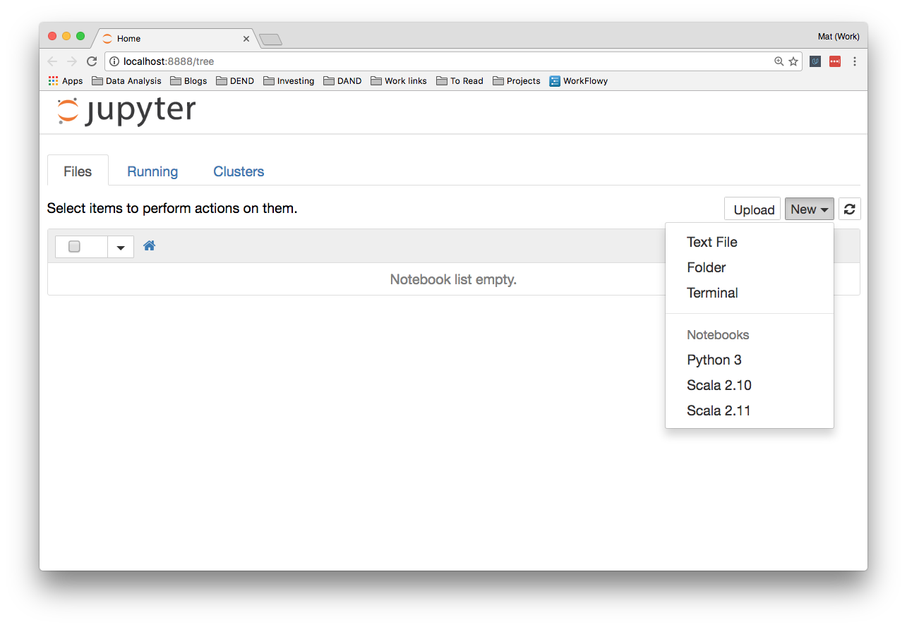
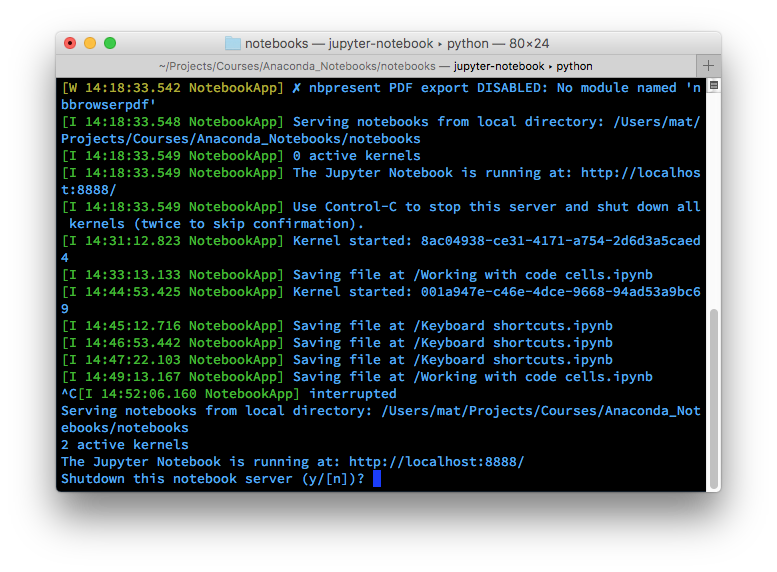

# Launching Jupyter Notebook Server

After you have installed the Jupyter Notebook on your computer, you are ready to run the notebook server. You can start the notebook server from the **command line** (using Terminal on Mac/Linux, Command Prompt on Windows) by running:

```console
$ jupyter notebook
```

This will start the server in the directory you ran the command in. That means any notebook files will be saved in that directory. Typically you'd want to start the server in the directory where your notebooks live. However, you can navigate through your file system to where the notebooks are.

When you run the command (try yourself!), it should print some information about the notebook server in your terminal, including the URL of the web application (by default, `http://localhost:8888`).

```console
$ jupyter notebook
[I 08:58:24.417 NotebookApp] Serving notebooks from local directory: /Users/catherine
[I 08:58:24.417 NotebookApp] 0 active kernels
[I 08:58:24.417 NotebookApp] The Jupyter Notebook is running at: http://localhost:8888/
[I 08:58:24.417 NotebookApp] Use Control-C to stop this server and shut down all kernels (twice to skip confirmation).
```
It will then open your default web browser to this URL. By default, the notebook server runs at `http://localhost:8888`. If you aren't familiar with this, `localhost` means your computer and `8888` is the port the server is communicating on. As long as the server is still running, you can always come back to it by going to `http://localhost:8888` in your browser.

If you start another server, it'll try to use port `8888`, but since it is occupied, the new server will run on port `8889`. Then, you'd connect to it at `http://localhost:8889`. Every additional notebook server will increment the port number like this.

If you tried starting your own server, it should look something like this:


**Notebook dashboard**

When the notebook opens in your browser, you will see the Notebook Dashboard, which will show a list of the notebooks, files, and subdirectories in the directory where the notebook server was started. Most of the time, you will wish to start a notebook server in the highest level directory containing notebooks.

You might see some files and folders in the list here, it depends on where you started the server from. Since we started the server in an empty directory there is not much here.

Over on the right, you can click on "**New**" to create a new notebook, text file, folder, or terminal. The list under "Notebooks" shows the kernels you have installed. The kernels are basically what programming languages you want to use in your notebooks. Here I'm running the server in a Python 3 environment, so I have a Python 3 kernel available. You might see Python 2 here. I've also installed kernels for Scala 2.10 and 2.11 which you see in the list. See this [documentation](https://ipython.readthedocs.io/en/latest/install/kernel_install.html) for how to install kernels if you ever need to do so.

Over on the right, you can also upload a file in the working directory and use in the current session by clicking on "**Upload**".

The tabs at the top show *Files*, *Running*, and *Cluster*. *Files* shows all the files and folders in the current directory. Clicking on the *Running* tab will list all the currently running notebooks.

*Clusters* previously was where you'd create multiple kernels for use in parallel computing. Now that's been taken over by [ipyparallel](https://ipyparallel.readthedocs.io/en/latest/intro.html) so there isn't much to do there.

You should consider installing Notebook Conda to help manage your environments. Run the following terminal command:

```console
$ conda install nb_conda
```

Then if you run the notebook server from a conda environment, you'll also have access to the "Conda" tab shown below. Here you can manage your environments from within Jupyter. You can create new environments, install packages, update packages, export environments and more.


**conda tab**

Additionally, with `nb_conda` installed you will be able to access any of your conda environments when choosing a kernel. For example, the image below shows an example of creating a new notebook on a machine with several different conda environments:


**conda environments in jupyter**

### Shutting down Jupyter
You can shutdown individual notebooks by marking the checkbox next to the notebook on the server home and clicking "Shutdown." Make sure you've saved your work before you do this though! Any changes since the last time you saved will be lost. You'll also need to rerun the code the next time you run the notebook.


You can shutdown the entire server by pressing `control` + `C` twice in the terminal. Again, this will immediately shutdown all the running notebooks, so make sure your work is saved!


